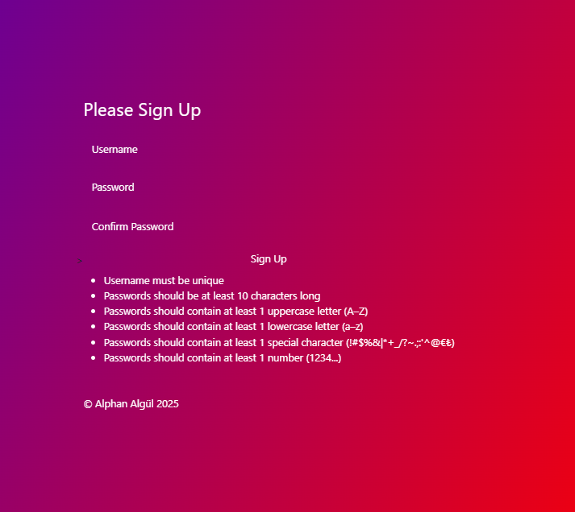
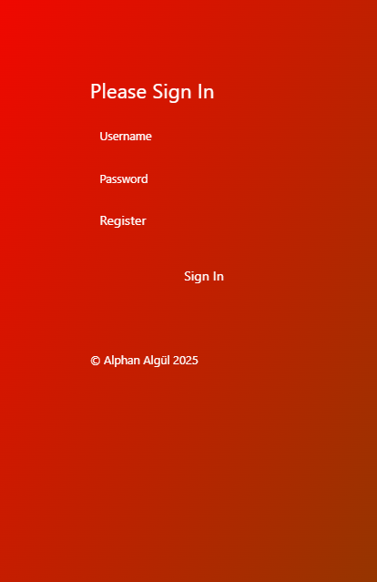
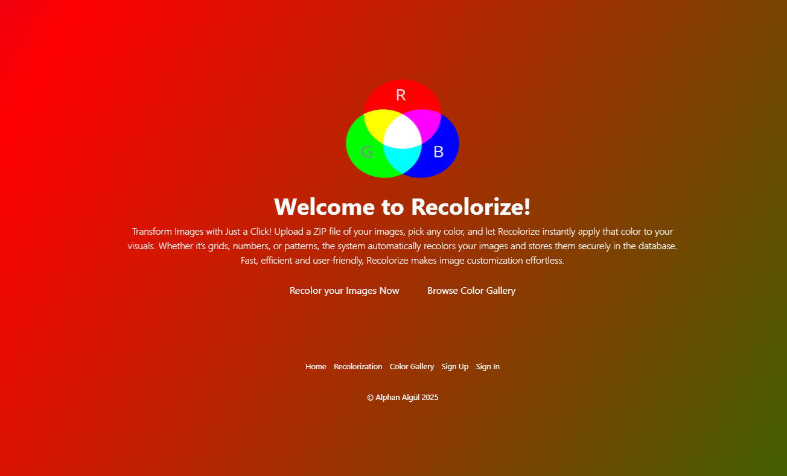
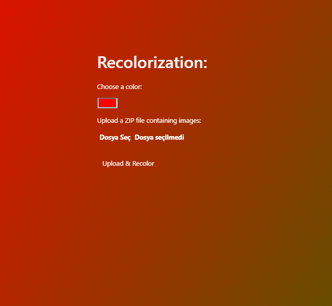
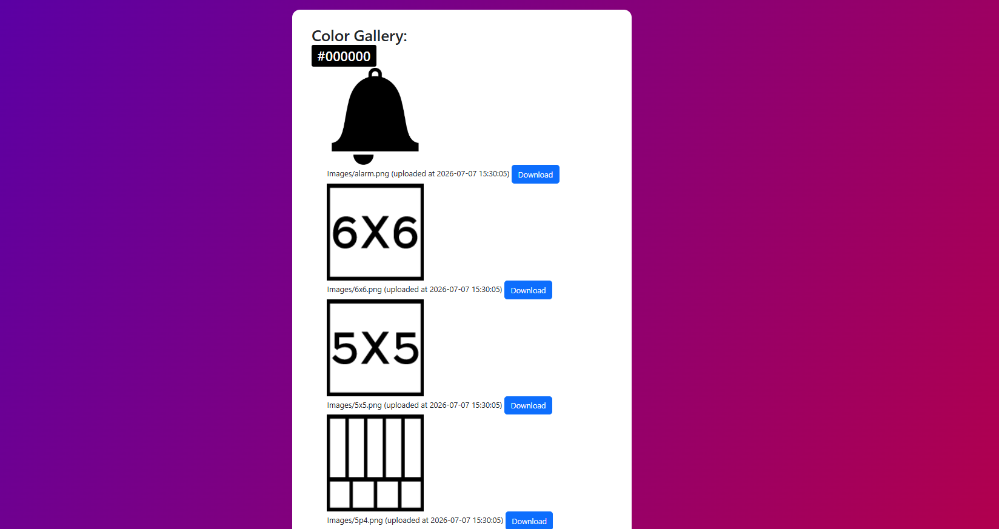

# ReColorize Web Application

ReColorize is a full-stack web application that allows users to upload a ZIP file containing images, select a target color, and automatically recolor red-dominant areas in those images. The processed images are stored in a PostgreSQL database and displayed in a color gallery where users can view and download the recolored results.

This application was developed as part of my internship learning process to improve my practical skills in JavaScript, Node.js, Express.js, Embedded JavaScript templates (EJS), server-side image processing, and PostgreSQL database integration.

## Features

- User registration and login system
- Secure password storage using bcrypt hashing
- Environment-based configuration using `.env`
- ZIP file upload support
- Batch image extraction and processing
- Supports `.png`, `.jpg`, and `.jpeg` image files
- Recolors red-dominant pixels based on a user-selected color
- Stores processed images in PostgreSQL
- Displays recolored images in a color gallery
- Groups gallery images by selected color
- Shows upload date and time for processed images
- Allows users to download recolored images
- Dynamic frontend pages using EJS
- Custom CSS styling for forms, pages, and gallery layout
- RGB gradient interface background that reflects the color-changing theme of the application

## Technologies Used

- Node.js
- Express.js
- EJS
- PostgreSQL
- bcrypt
- dotenv
- Multer
- Sharp
- AdmZip
- Luxon
- Express Session
- Express Flash
- CSS

## Purpose of the Project

The main purpose of this project was to improve my skills in full-stack web development. Through this application, I practiced backend development with Node.js and Express.js, dynamic page rendering with EJS, database operations with PostgreSQL, user authentication, server-side file upload handling, and image processing.

The interface also uses a dynamic RGB-style gradient background that switches between red, green, and blue tones. Since the application is centered around recoloring images, I wanted the visual design of the interface to reflect the idea of color transformation.

## Interfaces

### Registration Page

The registration page allows new users to create an account. It includes password validation rules such as minimum length, uppercase letters, lowercase letters, numbers, and special characters. Passwords are hashed using bcrypt before being stored in the database.



### Login Page

The login page allows registered users to sign in. During login, the application compares the entered password with the hashed password stored in the PostgreSQL database.



### Home Page

The home page acts as the main navigation page after login. From this page, users can access the recolorization interface and the color gallery.



### Recolorization Page

The recolorization page allows users to select a target color and upload a ZIP file containing images. The application extracts the ZIP file, processes supported image files, and replaces red-dominant pixels with the selected color.



### Color Gallery Page

The color gallery page displays the processed images stored in the database. Images are grouped according to the selected recolorization color. Users can view the recolored images and download them.



## How It Works

1. The user registers a new account or logs in.
2. The user opens the recolorization page.
3. The user selects a target color using the color picker.
4. The user uploads a ZIP file containing images.
5. The application extracts the ZIP file using AdmZip.
6. Each supported image file is processed using Sharp.
7. Red-dominant pixels are detected.
8. Matching pixels are replaced with the selected color.
9. The recolored image is converted to PNG format.
10. The processed image is stored in PostgreSQL.
11. The user can view and download the result from the color gallery.

## Recoloring Logic

The current implementation is designed to recolor red-dominant pixels. A pixel is considered red-dominant when it satisfies this condition:

```js
r > 150 && g < 120 && b < 120
```

When a matching pixel is found, its RGB values are replaced with the RGB values of the color selected by the user.

For example, if the user selects blue, red-dominant regions in the uploaded image are changed to blue.

## Project Structure

```text
ReColorize-Web-Application/
│
├── images/
│   ├── registration.png
│   ├── login.png
│   ├── home.png
│   ├── recolorization.png
│   └── color-gallery.png
│
├── public/
│   ├── assets/
│   ├── forms.css
│   ├── gallery.css
│   └── rgb.png
│
├── views/
│   ├── color-gallery.ejs
│   ├── home.ejs
│   ├── login.ejs
│   ├── recolorization.ejs
│   └── registration.ejs
│
├── .env.example
├── .gitignore
├── Recolorize.js
├── package.json
└── package-lock.json
```

## Installation

### 1. Clone the repository

```bash
git clone https://github.com/alphanalgul/ReColorize-Web-Application.git
cd ReColorize-Web-Application
```

### 2. Install dependencies

```bash
npm install
```

### 3. Create the PostgreSQL database

Create a PostgreSQL database named:

```sql
CREATE DATABASE "Recolorize";
```

### 4. Create the required tables

```sql
CREATE TABLE users (
    id SERIAL PRIMARY KEY,
    username VARCHAR(255) UNIQUE NOT NULL,
    password VARCHAR(255) NOT NULL
);

CREATE TABLE recolored_images (
    id SERIAL PRIMARY KEY,
    filename TEXT NOT NULL,
    image BYTEA NOT NULL,
    created_at TIMESTAMP DEFAULT NOW(),
    color VARCHAR(20)
);
```

### 5. Configure environment variables

Create a `.env` file in the root directory of the project.

```env
PORT=3000

DB_USER=postgres
DB_HOST=localhost
DB_NAME=Recolorize
DB_PASSWORD=your_postgresql_password_here
DB_PORT=5432

SESSION_SECRET=your_session_secret_here
```

## Running the Application

Start the application with:

```bash
npm start
```

Then open the application in your browser:

```text
http://localhost:3000
```

## Usage

1. Register a new account.
2. Log in with your account.
3. Go to the recolorization page.
4. Select a target color.
5. Upload a ZIP file containing `.png`, `.jpg`, or `.jpeg` images.
6. Submit the form.
7. Open the color gallery page.
8. View or download the recolored images.

## Sample Images

The repository includes sample images that demonstrate the type of images the application is intended to process. These images contain red-dominant areas that can be recolored by the application.

Example use case:

- Upload grid or pattern images containing red sections.
- Select a new color.
- Generate recolored versions automatically.
- View and download the processed images from the color gallery.

## What I Learned

Through this project, I practiced:

- Building a backend server with Node.js and Express.js
- Creating dynamic pages with EJS
- Handling form submissions
- Managing user sessions
- Implementing registration and login logic
- Hashing passwords with bcrypt
- Using environment variables with dotenv
- Connecting a Node.js application to PostgreSQL
- Uploading and processing ZIP files
- Manipulating image pixels using Sharp
- Storing and retrieving binary image data from a database
- Organizing a full-stack web application project
- Designing an interface that visually reflects the application's color-changing purpose

## Future Improvements

Possible future improvements include:

- Adding user-specific galleries
- Adding image preview before upload
- Supporting more source colors, not only red-dominant pixels
